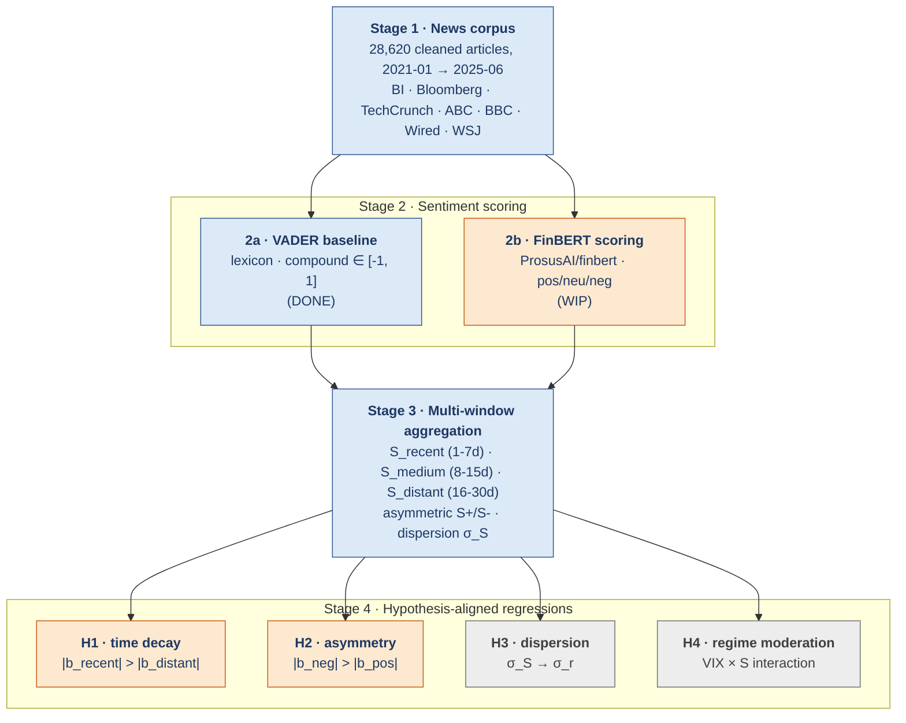

# Tesla Sentiment → Returns: A Multi-Dimensional News-Sentiment Framework

> Public preview of an **in-progress** undergraduate research project on
> the relationship between news-derived sentiment and TSLA equity returns.
> The repo is intentionally honest about which components are
> reproduced end-to-end (Stage 1, Stage 2a, Stage 3 baseline) and which
> are still being built (Stage 2b transformer scoring, Stage 4
> hypothesis-aligned regressions).

[](#status)
[](#status)
[](docs/REPRODUCE.md)

**Author:** Jie Yuan (袁捷) · Wenzhou-Kean University · Department of Mathematical Sciences  
**Collaborator / advisor:** (to be added with permission)  
**Current snapshot:** v0.7  ·  May 2026

---

## 1. The question

> *Beyond merely predicting price, can we systematically decompose
> **how** news sentiment moves a stock — by horizon, by sign, by
> dispersion, and by market regime?*

Most prior LLM-era sentiment-and-returns work treats sentiment as a
single scalar feature and asks whether it improves price prediction.
That framing answers a thin question and obscures four substantive
structural ones:

1. **Time decay.** How quickly does the effect of a news shock decay
   across horizons? Is it exponential, linear, or essentially flat?
2. **Asymmetry.** Are negative-sentiment shocks bigger than
   positive-sentiment shocks of equal magnitude? Prospect theory
   predicts ≈2× loss-aversion (Kahneman & Tversky 1979); does it show
   up in equity-return panels?
3. **Dispersion.** Does cross-article *disagreement* (high `σ_S`)
   forecast future return *volatility* — independent of mean
   sentiment? Miller (1977) predicts yes.
4. **Regime moderation.** Are these effects stable, or do they
   strengthen / weaken in high-VIX / earnings-week / macro-stress regimes?

This project addresses all four jointly, using a single coherent
multi-window feature design.

## 2. Pipeline at a glance



<sub>Static PNG version: [`figures/architecture_overview.png`](figures/architecture_overview.png).</sub>

| Colour | Meaning |
|---|---|
| 🟦 Blue | Implemented in this repo, numbers reproduced end-to-end |
| 🟧 Amber | Architecture finalized, implementation in progress |
| ⬜ Grey | Interface defined, work scheduled |

## 3. What is reproduced in this repo today

Run `python scripts/run_vader_baseline.py` end-to-end (≈30 s on a CPU)
and you get:

| Step | Output | Numbers (real) |
|---|---|---|
| Corpus cleaning | `data/README.md` | 28,620 articles kept from 28,657 raw |
| Date span | `results/eda_summary.json` | 2021-01-01 → 2025-06-01 |
| Source coverage | `figures/eda_source_distribution.png` | 7 sources, BI/Bloomberg/TechCrunch/ABC/BBC/Wired/WSJ |
| VADER scoring | `results/vader_per_article.parquet` | mean 0.0021 · std 0.352 · 30.2% pos / 40.8% neu / 29.0% neg |
| Daily aggregation | `results/sentiment_daily.csv` | 1,106 trading days joined with TSLA returns |
| **Baseline correlation** | `results/baseline_correlation.json` | see Table 1 |

**Table 1 — Baseline single-feature correlations (TSLA, 2021-01 → 2025-06)**

| Pair | Pearson r | p | Spearman ρ | p |
|---|---:|---:|---:|---:|
| Daily VADER vs same-day return | **0.084** | **0.005** | **0.082** | **0.006** |
| Daily VADER vs next-day return | 0.012 | 0.685 | 0.000 | 0.996 |

This is exactly the empirical gap the project is designed to close:
**news sentiment is significantly correlated with same-day returns
but a naive single-feature daily-mean has no next-day predictive
power**. The structural questions in §1 ask whether a
hypothesis-aligned multi-window feature set produces incremental
predictive R² above the controls-only baseline. That is the M1–M4
work in `docs/methodology.md` §5.

## 4. Status

| Component | State | Where to look |
|---|---|---|
| Corpus collection (28k articles) | ✅ Done | `data/README.md`, `results/eda_summary.json` |
| Deterministic pre-processing | ✅ Done | `src/preprocessing.py` |
| VADER scoring layer | ✅ Done | `src/sentiment.py::VaderScorer` |
| EDA & figures | ✅ Done | `scripts/run_eda.py` |
| Multi-window aggregator | ✅ Done (interface + impl) | `src/aggregation.py` |
| Feature / design-matrix builder | ✅ Done | `src/features.py` |
| TSLA price + return join | ✅ Done | `scripts/run_vader_baseline.py` |
| Baseline correlation table | ✅ Done | `results/baseline_correlation.json` |
| FinBERT scoring layer | 🚧 In progress | `src/sentiment.py::score_corpus_finbert` |
| HAC-OLS for M1 / M2 hypothesis tests | 🚧 In progress | `src/model.py::fit_ols_with_hac` |
| Decay-curve fitting (H1b) | 🚧 In progress | `src/model.py::fit_decay_curve` |
| Asymmetry Wald test (H2a) | 🚧 In progress | `src/model.py::asymmetry_test` |
| Regime-moderation tests (M4) | 📋 Planned | proposal §5.4 |
| Robustness battery (sub-period, source-drop, lag-grid) | 📋 Planned | proposal §6 |
| Manuscript draft | 📋 Planned | — |

Honest summary: **Stage 1 + baseline result are end-to-end reproducible
right now.** Stage 2b (FinBERT) and Stage 4 (hypothesis tests) are
architected and stubbed but not yet plugged into the driver script.

## 5. Reproducing the numbers

See **[docs/REPRODUCE.md](docs/REPRODUCE.md)** for a step-by-step.
TL;DR: three commands, ≈30 s on a laptop:

```bash
pip install -r requirements.txt
python scripts/run_eda.py
python scripts/run_vader_baseline.py
```

Every numeric value cited in this README is read directly from the
JSON / CSV produced by these scripts — nothing is hard-coded into the
documentation.

## 6. Methodology (one-page version)

  * **Target:** next-day log return `r_{t+1} = ln(P_{t+1} / P_t)`
  * **Sample:** TSLA, 2021-01-01 → 2025-06-01, ≈1,100 trading days
  * **Sentiment features** for each trading day `t`:
    `S_recent` (`t−7..t−1`), `S_medium` (`t−15..t−8`), `S_distant` (`t−30..t−16`),
    plus signed (`S+`, `S−`) and dispersion (`σ_S`) variants
  * **Controls:** market return (SPY), VIX, lagged return, volume change
  * **Estimator:** OLS with Newey-West HAC SE (lag = 5)
  * **Look-ahead bias guard:** day-`t` window is excluded from `S(t)`;
    target is strictly `r_{t+1}` measured at the next session's close

Full discussion in **[docs/methodology.md](docs/methodology.md)**.

## 7. What this preview is NOT

  * Not a productionised trading signal. The framework is descriptive
    research, not a strategy.
  * Not a benchmark against state-of-the-art deep models — the
    contribution is the **feature design**, paired with a deliberately
    simple linear estimator so the empirical claims attach to the
    design rather than to model capacity.
  * Not a causal identification. Every claim is a conditional
    correlation; the limitations section of the methodology doc
    spells this out.

## 8. Project structure

```
tesla-sentiment-event-nlp/
├── README.md                      # this file
├── LICENSE                        # MIT
├── requirements.txt
├── data/
│   └── README.md                  # corpus description (raw data gitignored)
├── docs/
│   ├── methodology.md             # technical companion to this README
│   └── REPRODUCE.md               # step-by-step reproduction
├── src/
│   ├── __init__.py
│   ├── preprocessing.py           # text + date cleaning (DONE)
│   ├── sentiment.py               # VADER (DONE) + FinBERT (WIP)
│   ├── aggregation.py             # multi-window temporal aggregator (DONE)
│   ├── features.py                # design-matrix builder (DONE)
│   └── model.py                   # HAC OLS, decay fit, asymmetry test (WIP)
├── scripts/
│   ├── run_eda.py                 # reproduces EDA figures (DONE)
│   └── run_vader_baseline.py      # reproduces baseline table (DONE)
├── figures/
│   ├── make_architecture.py
│   ├── architecture_overview.png
│   ├── eda_articles_per_month.png
│   ├── eda_source_distribution.png
│   ├── eda_title_length_hist.png
│   ├── sentiment_vs_return.png
│   └── sentiment_daily_timeseries.png
└── results/
    ├── eda_summary.json
    ├── sentiment_daily.csv
    └── baseline_correlation.json
```

## 9. Roadmap

| When | Milestone |
|---|---|
| 2026-05 (now) | Stage 1 + baseline correlation reproduced end-to-end |
| 2026-06 | FinBERT layer wired in, calibration agreement vs VADER reported |
| 2026-07 | M1 / M2 hypothesis tests with HAC SEs and incremental-R² |
| 2026-08 | M3 dispersion / M4 regime-moderation tests |
| 2026-09 | Robustness battery (sub-period split, source-drop, lag-grid) |
| 2026-10 | Manuscript v1 |

## 10. Related work (short)

  * Tetlock, P. C. (2007). *Giving content to investor sentiment: The
    role of media in the stock market.* Journal of Finance.
  * Kahneman, D., & Tversky, A. (1979). *Prospect theory.* Econometrica.
  * Miller, E. M. (1977). *Risk, uncertainty, and divergence of opinion.*
    Journal of Finance.
  * Lo, A. W. (2004). *The adaptive markets hypothesis.* Journal of
    Portfolio Management.
  * Araci, D. (2019). *FinBERT.* arXiv:1908.10063.

Full bibliography (with relation-to-this-project commentary) in
`docs/methodology.md`.

## 11. Contact

**Jie Yuan** (袁捷) · 📧 [yuanjie@kean.edu](mailto:yuanjie@kean.edu)

If you would like access to the in-progress private development repo
(transformer scoring, ongoing hypothesis-test code, draft manuscript)
for **collaboration, recruiting, or referee review** purposes — please
email with a brief note about your role and intended use.

---

<sub>*This README is a working document and is updated as components
move from "in progress" to "done". The last update timestamp is in the
git log — see commit history.*</sub>
